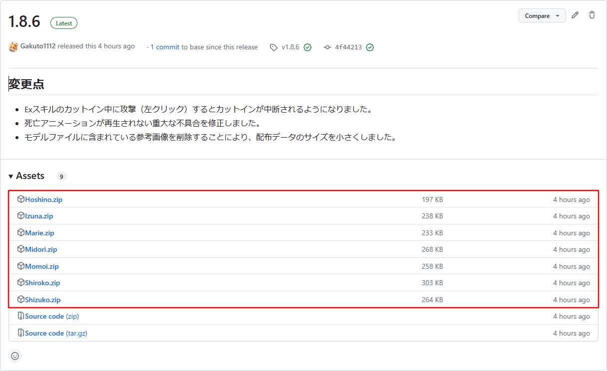

# MyFiguraAvatarPacker
私（[Gakuto1112](https://github.com/Gakuto1112)）が作成する[Figura](https://modrinth.com/mod/figura)アバターを配布しやすい形式に加工するワークフローです。

このレポジトリには以下のワークフローが利用可能です。

- レポジトリにあるアバターを配布しやすい形式に加工し、アーティファクトとしてアップロードする。
- リリースが作成された際（プレリリースも含む）にアバターの加工を行い、リリースアセットにアバターデータを追加する。

ワークフローで行われる加工では、以下のことが行われます。

- アバターを使用する上で不要なデータ（`.github/`など）を削除する。
  - `LICENSE`は含まれます。
- レポジトリ上にあるREADMEを読むことを促す、簡易的な`README.txt`を生成する。
- モデルファイル上にある参照画像（アバターを使用する上では一切必要ない）を削除し、配布ファイルのサイズを減らす。

これらの加工は非破壊的であるため、レポジトリにあるアバターのデータが上書きされることはありません。
ご安心ください。

このレポジトリのワークフローを使用したレポジトリでリリースが作成されると以下のような感じになります。



上記画像のリリースには以下のリンクからアクセスできます。
https://github.com/Gakuto1112/FiguraBlueArchiveCharacters/releases/tag/v1.8.6

## 使用条件について
このレポジトリのワークフローのコアをそのまま使用するには、以下の条件を満たす必要があります。

- 1つのブランチにアバターが1つのみである。
- レポジトリの構造が以下のようになっている。

  ```
  ブランチのルート
  ├ .github/
  │ ├ README.md（英語で書かれたREADME）
  │ └ README_jp.md（日本語で書かれたREADME）
  ├ models/
  │ └ （ここにアバターモデルが全て入っている。ここ以外は認められない。）
  ├ scripts/
  │ └ （ここにアバタースクリプトが全て入っている。ここ以外は認められない。）
  ├ textures/
  │ └ （ここにアバターテクスチャが全て入っている。ここ以外は認められない。）
  ├ LICENSE（無くてもよい）
  ├ avatar.json
  └ avatar.png
  ```

  - ここに書かれていないファイル/ディレクトリが存在していも問題はないですが、これらは無視されます。
  - [こちらのテンプレート](https://github.com/Gakuto1112/FiguraAvatarTemplate)を使用すると、上記形式に従いやすくなります。

## 加工済みアバターファイルについて
ワークフローによって加工されたアバターファイルはアーティファクトとしてアップロードされます。
アバターファイルをダウンロードするとzip圧縮されているので展開してください。

アバターファイルは以下のような構造になっています。

```
アバターファイル.zip
├ アバターフォルダ/
│ └ ...
├ LICENSE（レポジトリに含まれている場合のみ）
└ README.txt
```

アバターフォルダをFiguraのアバターディレクトリ（`...\.minecraft\figura\avatars\`、環境によって異なります）に入れるとゲーム内でアバターを使用できるようになります。

アバターファイル及びアバターフォルダの名前は、アバターがあるブランチの名前になります。

## ワークフローファイルについて
`.github/workflows`に[GitHub Actions](https://github.co.jp/features/actions)ワークフローの定義ファイルがあります。

### pack_figura_avatar.yml
レポジトリにあるアバターを配布しやすい形式に加工し、それをアーティファクトとしてアップロードします。

#### 実行引数
- **target_branch**

  必須、string

  加工する対象のアバターがあるブランチの名前

- **avatar_name**

  任意、string

  加工する対象のアバターの名前。
  これを指定することにより、アバター名を上書きできます。
  省略するとアバター名はブランチ名と同じになります。

- **includes**

  任意、string

  必須ファイル/ディレクトリ以外にアバターに含めたいファイル/ディレクトリをJSON配列で指定します。

  （例）：`["sounds", "avatar_2.png"]`

### attach_avatars.yml
リリースが作成された際にリリースのアセットに複数（又は単一）のアバターファイルを添付します。
このワークフローは必ず`release`イベントでトリガーされた場合のみ呼び出してください。
`pack_figura_avatar.yml`もこのワークフローに含まれているため、同時に実行する必要はありません。

#### 実行引数
- **target_branches**

  必須、string

  リリースアセットに添付する対象のアバターがあるブランチの名前をJSON配列にしたもの

  （例）：`["Shiroko", "Hoshino", "Marie", "Momoi", "Midori", "Izuna", "Shizuko"]`

- **avatar_names**

  任意、string

  加工する対象のアバターの名前をJSON key-value形式で指定します。
  キーをアバターのブランチ名に、値をアバター名にします。
  省略するとアバター名はブランチ名と同じになります。

  （例）：`{"main": "CatMaid"}`

- **includes**

  任意、string

  必須ファイル/ディレクトリ以外にアバターに含めたいファイル/ディレクトリをJSON配列で指定します。

  （例）：`["sounds", "avatar_2.png"]`

### ワークフローの呼び出しについて
これらのワークフローを自身のレポジトリで呼び出したい場合、`template_workflows/`内にあるワークフローファイルを自身のレポジトリの`.github/workflows/`に追加してください。

ワークフローの呼び出し部分と処理のコア部分は別々になっているため、ワークフローがシンプルになります。
また、コア部分のアップデートも随時適用されます。